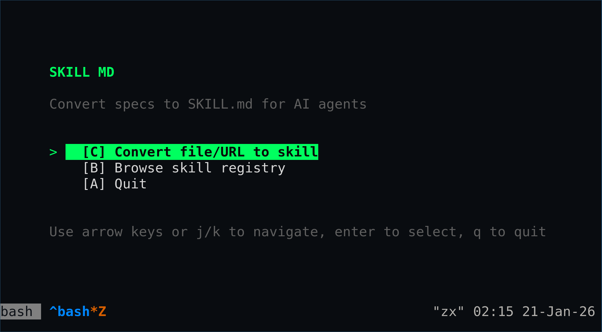

# Skill MD

Convert any technical specifications into SKILL.md format for AI agents.





## Features

- **11 Input Formats** - OpenAPI, GraphQL, Postman, AsyncAPI, Protobuf/gRPC, RAML, WSDL, API Blueprint, URL, PDF, Plain Text
- **MCP Compatible** - Generated skills include tool definitions for AI agents
- **Merge** - Combine multiple SKILL.md files with intelligent deduplication
- **Browse** - Search and explore the skill registry
- **Web UI** - Dark terminal-themed interface with HTMX
- **CLI** - Full-featured command line interface
- **SSH TUI** - Terminal UI accessible via SSH

## Installation

### Quick Install

```bash
curl -fsSL https://raw.githubusercontent.com/sanixdarker/skill-md/main/scripts/install.sh | bash
```

### From Source

```bash
go install github.com/sanixdarker/skill-md/cmd/skillmd@latest
```

### Docker

```bash
docker run -p 8080:8080 sanixdarker/skill-md
```

## Usage

### Web Server

Start the web server:

```bash
skillmd serve
# Server running at http://localhost:8080
```

Options:
- `--port, -p` - Port to listen on (default: 8080)
- `--db` - Path to SQLite database (default: ./skill-md.db)
- `--debug` - Enable debug mode

### Convert

Convert a specification file to SKILL.md:

```bash
# Auto-detect format
skillmd convert api.yaml

# Specify format
skillmd convert schema.graphql -f graphql

# Save to file
skillmd convert api.yaml -o skill.md

# Custom name
skillmd convert api.yaml -n "My API Skill"
```

Supported formats:
- `openapi` - OpenAPI 3.x (YAML/JSON)
- `graphql` - GraphQL schema
- `postman` - Postman collection
- `asyncapi` - AsyncAPI specs (Kafka, MQTT, WebSocket, AMQP)
- `proto` - Protocol Buffers / gRPC
- `raml` - RAML 1.0
- `wsdl` - WSDL/SOAP
- `apiblueprint` - API Blueprint (.apib)
- `url` - Web page extraction
- `pdf` - PDF document extraction
- `text` - Plain text

### Merge

Merge multiple SKILL.md files:

```bash
# Basic merge
skillmd merge skill1.md skill2.md

# Save to file
skillmd merge skill1.md skill2.md -o combined.md

# With deduplication
skillmd merge skill1.md skill2.md --dedupe

# Custom name
skillmd merge skill1.md skill2.md -n "Combined Skills"
```

### Validate

Validate a SKILL.md file:

```bash
skillmd validate skill.md
```

## SKILL.md Format

SKILL.md is a structured markdown format for AI agent skills:

```markdown
---
name: "API Skill"
version: "1.0.0"
description: "API operations and endpoints"
tags:
  - "api"
  - "rest"
source_type: "openapi"
---

## Overview

Description of the skill and its capabilities.

## Endpoints

### GET /users

Retrieve all users.

**Parameters**:
| Name | Type | Required | Description |
|------|------|----------|-------------|
| limit | integer | No | Max results |

**Responses**:
| Code | Description |
|------|-------------|
| 200 | Success |
```

## Development

### Requirements

- Go 1.23+
- Make (optional)

### Build

```bash
# Build binary
make build

# Build for all platforms
make build-all

# Run in development mode
make dev
```

### Test

```bash
make test
make test-coverage
```

### Docker

```bash
# Build image
make docker

# Run with docker compose
make docker-compose
```

## Project Structure

```
skillmd/
├── cmd/skillmd/        # CLI entry point
├── internal/
│   ├── app/               # Application container
│   ├── cli/               # CLI commands
│   ├── converter/         # Spec converters
│   ├── merger/            # Skill merging
│   ├── registry/          # Skill registry
│   ├── server/            # HTTP server
│   └── storage/           # Database
├── pkg/skill/             # Public skill types
├── web/                   # Web assets
└── scripts/               # Install scripts
```

## License

MIT License - see [LICENSE](LICENSE) for details.

## Author

sanix darker
