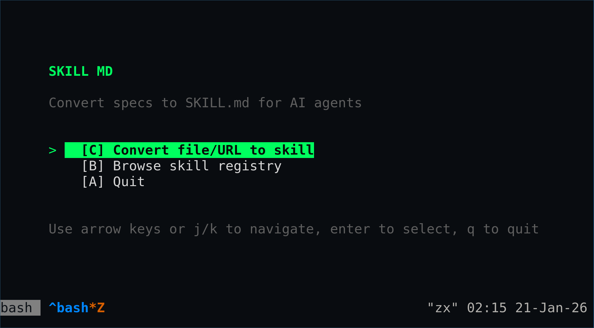

# Skillf

SKILL.md workbench for AI agent skills.

Convert, merge, browse, and operate SKILL.md workflows from the web UI, CLI, or SSH TUI.





## Features

- **11 Input Formats** - OpenAPI, GraphQL, Postman, AsyncAPI, Protobuf/gRPC, RAML, WSDL, API Blueprint, URL, PDF, Plain Text
- **MCP Compatible** - Generated skills include tool definitions for AI agents
- **Merge Workbench** - Combine multiple SKILL.md files with conflict strategies, source visibility, and deduplication
- **Browse + Search** - Explore the local registry and connected sources from web or terminal
- **Web UI** - Browser workbench for convert, merge, browse, and runtime checks
- **CLI** - Full-featured command line interface for convert, merge, validate, and serve workflows
- **SSH TUI** - Terminal-first UI accessible over SSH for convert/search/browse/merge workflows
- **Runtime Status API** - `/health` and `/api/system` for deployment diagnostics and SSH readiness

## Installation

### Quick Install

```bash
curl -fsSL https://raw.githubusercontent.com/Sanix-Darker/skill-md.dev/main/scripts/install.sh | bash
```

### From Source

```bash
git clone https://github.com/Sanix-Darker/skill-md.dev.git
cd skill-md.dev
go build -trimpath -ldflags='-s -w' -o skillf ./cmd/skillf
```

### Docker

```bash
docker run -p 8080:8080 sanixdarker/skillf
```

## Usage

### Web Server

Start the web server:

```bash
skillf serve
# Server running at http://localhost:8080
```

SSH console and diagnostics:

```bash
skillf serve --public-host example.com --ssh-port 2222
ssh example.com -p 2222
curl -fsS https://example.com/health
curl -fsS https://example.com/api/system
```

Options:
- `--port, -p` - Port to listen on (default: 8080)
- `--db` - Path to SQLite database (default: ./skillf.db)
- `--debug` - Enable debug mode

### Convert

Convert a specification file to SKILL.md:

```bash
# Auto-detect format
skillf convert api.yaml

# Specify format
skillf convert schema.graphql -f graphql

# Save to file
skillf convert api.yaml -o skill.md

# Custom name
skillf convert api.yaml -n "My API Skill"
```

Supported formats:
- `openapi` - OpenAPI 3.x (YAML/JSON)
- `graphql` - GraphQL schema
- `postman` - Postman collection
- `asyncapi` - AsyncAPI specs (Kafka, MQTT, WebSocket, AMQP)
- `proto` - Protocol Buffers / gRPC
- `raml` - RAML 1.0
- `wsdl` - WSDL/SOAP
- `apiblueprint` - API Blueprint (.apib)
- `url` - Web page extraction
- `pdf` - PDF document extraction
- `text` - Plain text

### Merge

Merge multiple SKILL.md files:

```bash
# Basic merge
skillf merge skill1.md skill2.md

# Save to file
skillf merge skill1.md skill2.md -o combined.md

# With deduplication
skillf merge skill1.md skill2.md --dedupe

# Custom name
skillf merge skill1.md skill2.md -n "Combined Skills"
```

Web workflow:
- Upload multiple files directly in the merge page.
- Search local or connected sources and build a merge queue.
- Choose a conflict strategy before generating the final SKILL.md.

### Validate

Validate a SKILL.md file:

```bash
skillf validate skill.md
```

## SKILL.md Format

SKILL.md is a structured markdown format for AI agent skills:

```markdown
---
name: "API Skill"
version: "1.0.0"
description: "API operations and endpoints"
tags:
  - "api"
  - "rest"
source_type: "openapi"
---

## Overview

Description of the skill and its capabilities.

## Endpoints

### GET /users

Retrieve all users.

**Parameters**:
| Name | Type | Required | Description |
|------|------|----------|-------------|
| limit | integer | No | Max results |

**Responses**:
| Code | Description |
|------|-------------|
| 200 | Success |
```

## Development

### Requirements

- Go 1.23+
- Make (optional)

### Build

```bash
# Build binary
make build

# Build for all platforms
make build-all

# Run in development mode
make dev
```

### Test

```bash
make test
make test-coverage
```

### Docker

```bash
# Build image
make docker

# Run with docker compose
make docker-compose
```

## Project Structure

```
skillf/
├── cmd/skillf/        # CLI entry point
├── internal/
│   ├── app/               # Application container
│   ├── cli/               # CLI commands
│   ├── converter/         # Spec converters
│   ├── merger/            # Skill merging
│   ├── registry/          # Skill registry
│   ├── server/            # HTTP server
│   └── storage/           # Database
├── pkg/skill/             # Public skill types
├── web/                   # Web assets
└── scripts/               # Install scripts
```

## License

MIT License - see [LICENSE](LICENSE) for details.

## Author

sanix darker

sanix darker
